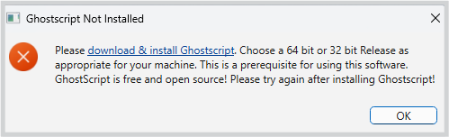

# PDF Shrinker    


_An easy to use GUI app that runs on top of Ghostscript for compressing or reducing the size of PDF files._

---
## 📋 Table of Contents 

- <a hef="#overview">Overview</a>
- <a hef="#features">Features</a>
- <a hef="#quickstart">Quick Start</a>
- <a hef="#install">Installation</a>
- <a hef="#run">How to Run</a>
- <a hef="#docs">Documentation</a>
- <a hef="#tools">Programming Tools</a>
- <a hef="#bin">Packaging Binaries</a>
- <a hef="#contact">Author</a>

---
<a href="https://choosealicense.com/licenses/mit/"></a>   


<h2><a class="anchor" id="overview"></a>🧭Overview</h2>
PDF Shrinker is a minimalistic and easy to use GUI app for compressing or reducing the size of PDF files. It works on top of [Ghostscript](https://www.ghostscript.com/) which needs to be installed on the user computer for PDFShrinker to work. Ghostscript is  open source and is free for non-commercial use. 

<h2><a class="anchor" id="overview"></a>📜Features</h2>

- Compress PDFs or reduce the size of the PDF
- Alter PDF Compatibility
- Convert coloured PDFs to Grayscale
- Flatten PDFs

<h2><a class="anchor" id="quickstart"></a>🚀 Quick Start</h2>

- Install [Ghostscript](https://www.ghostscript.com/releases/gsdnld.html) 
- Install PDFShrinker &rarr; All installers and their SHA256 checksums are available from the Assets section on the [release page](https://github.com/chinmayasrathore/pdf-shrinker/releases/tag/v1.0.0) . 
- Start compressing PDFs

For more details, see installation and documentation sections. 

<h2><a class="anchor" id="install"></a>🏗️ Installation</h2>
To install PDFShrinker, follow the steps below in sequence:


### Windows 
#### 1. Download and Install Ghostscript

For windows, [download the Ghostscript installer](https://www.ghostscript.com/releases/gsdnld.html) and follow screen instructions to install. 


#### 2. Download and Install PDFShrinker

Download PDF Shrinker installer  [pdfshrinker_1.0.0_x64-setup.exe](https://github.com/chinmayasrathore/pdf-shrinker/releases/download/v1.0.0/pdfshrinker_1.0.0_x64-setup.exe)  and install it following screen instructions. ([SHA256 Checksum](https://github.com/chinmayasrathore/pdf-shrinker/releases/download/v1.0.0/win-sha256.txt))

Windows users may get the following system advisory during installation. They will need to choose <button>More info</button> followed by <button>Run anyway</button> to proceed with the installation (see screenshot below). This message is generated because the app has not been digitally signed by the app developer. App signing certificates are insanely expensive for individual developers! As PDF Shrinker is open source, anyone can inspect the source code on this site.  


If you try to run PDFShrinker without first installing, the software will display a message shown below requesting the user to install Ghostscript. 



### Linux 
#### 1. Download and Install Ghostscript
Linux users, can first check if they have Ghostscript already installed by using the following command from the terminal:

```
ghostscript --version  or gs --version
```
    
If no version number is reported, use the following command from the terminal to install Ghostscript:

##### Ubuntu/Debian
```
sudo apt install ghostscript
```
##### RHEL/Fedora
```
sudo dnf install ghostscript
```
Ghostscript is also available for Linux (64-bit) as a *snap package* from the Ghostscript download page mentioned above. 

#### 2. Download and Install PDF Shrinker

##### Ubuntu/Debian
 Download the [pdfshrinker_1.0.0_amd64.deb](https://github.com/chinmayasrathore/pdf-shrinker/releases/download/v1.0.0/pdfshrinker_1.0.0_amd64.deb) package and double click on the downloaded file to install via the software manager. ([SHA256 Checksum](https://github.com/chinmayasrathore/pdf-shrinker/releases/download/v1.0.0/deb-sha256.txt))

OR 
 
 open a terminal, navigate to the folder that has the downloaded _pdfshrinker_1.0.0_amd64.deb_ package and issue the following command:

```
sudo dpkg -i pdfshrinker_1.0.0_amd64.deb
```

##### RHEL/Fedora

Download the [pdfshrinker_1.0.0_amd64.rpm](https://github.com/chinmayasrathore/pdf-shrinker/releases/download/v1.0.0/pdfshrinker_1.0.0_amd64.rpm) package and double click on the downloaded file to install via the software manager. ([SHA256 Checksum](https://github.com/chinmayasrathore/pdf-shrinker/releases/download/v1.0.0/rpm-sha256.txt))

OR
 
 open a terminal, navigate to the folder that has the downloaded _pdfshrinker_1.0.0_amd64.rpm_ package and issue the following command:

```
sudo dnf install pdfshrinker_1.0.0_amd64.rpm
```

---

<h2><a class="anchor" id="run"></a>🏃‍♀️‍➡️Running the App</h2>

After installing PDF Shrinker, just search for the app in your computers app search and double click on the app icon to start the app. For windows, the search for PDFShrinker should show the app as shown below:

PDF Shrinker in Windows 11 search after Install 


PDF Shrinker in Fedora Linux Apps after install 


Searching for PDF Shrinker in Linux Mint after install 


This should start the app interface as shown below: 


>[!NOTE]
>Windows users can pin PDF Shrinker to start or taskbar while linux users can add to panel (debian) or dash(fedora) for easy access.

Using the PDF Shrinker app is straight forward:
1. Provide an input PDF that you wish to compress.
2. Provide an output file  name for the compressed file.
3. Choose a Compression preset (screen,ebook and default provide maximum compression in that order).
4. Press the <button>Shrink PDF</button> button to compress the input PDF file.   

See app documentation for more information and advanced settings with which you can have more granular control over resulting file size and quality. 

---

<h2><a class="anchor" id="docs"></a>📖Documentation</h2>

You can read app documentation online or download it as a PDF or EPUB from the links below:

<a href="docs/pdfshrinker-html.html"></a>

<a href="docs/pdfshrinker.pdf"></a> <a href="docs/pdfshrinker-epub3.epub"></a>

The app documentation provides more details about various options and provides some helpful practical examples. 

You can also watch a video tutorial by the author to get a quick heads up.

<a href="docs/video.html"></a>

---

<h2><a class="anchor" id="tools"></a>🛠️Programming Tools</h2>

PDFShrinker has been written entirely in **Python**. The graphical user interface has been developed using **PySide6** and **QTDesigner**. The binaries  have been built using **PyInstaller**. 

<h2><a class="anchor" id="tools"></a>📦 Packaging Binaries</h2>

To build the executable/binary yourself, the general steps are (same for Windows and Linux):
1. Install *Ghostscript* (It is assumed that ***python3*** is already installed).
2. Copy the _src folder_ (which contains pdfshrinker.py and the icons folder) on your machine and open the *pdsfshrinker.py* file in an IDE like VS Code (or PyCharm etc).
3. You can create a .venv if you like for this project. 
3. Install pyside6 (pip install pyside6) and run the python file (python pdfshrinker.py) --> the app should start. 
4. Finally to get the binary install pyinstaller (pip install pyinstaller)
5. Run pyinstaller on the pdfshrinker (pyinstaller psdfshrinker.py)
6. The _dist_ folder will have the executable (pdfshrinker). 
7. In case you find that the icons in the app are missing, open the _pdfshrinker.spec_ in a text editor ( nano, notepad++, notepad etc.) and make sure that you have the following line in the analysis block of the _pdfshrinker.spec_ file (replacing datas=[ ]):<BR>
 datas=[('icons', 'icons')],
8. You can then re-run pyinstaller with the spec file (pyinstaller pdfshrinker.spec) to update the build in the _dist_ folder. 
9. You can start the app by clicking on the _pdfshrinker application_ inside the dist folder. 


<h2><a class="anchor" id="contact"></a>🙋‍♂️Author</h2>
PDF Shrinker has been created by <a HREF="https://chinmayasrathore.github.io/">Dr. Chinmaya S Rathore</a>. 